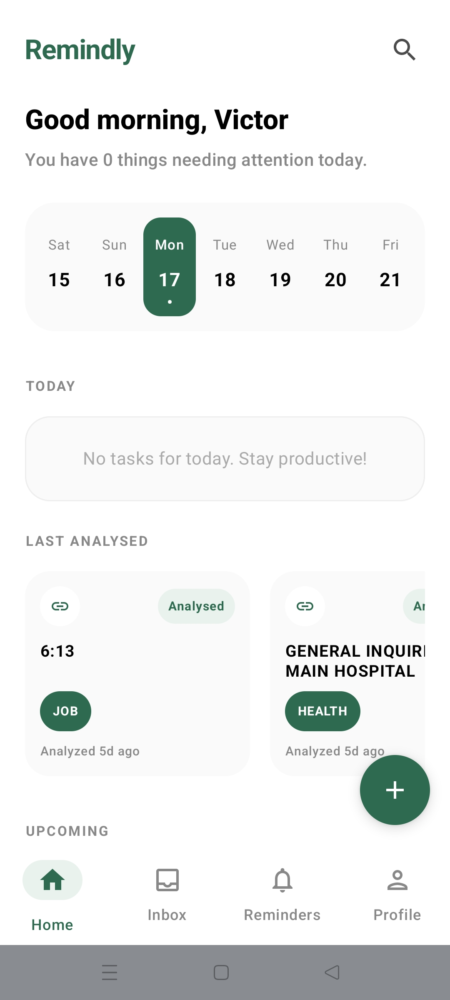
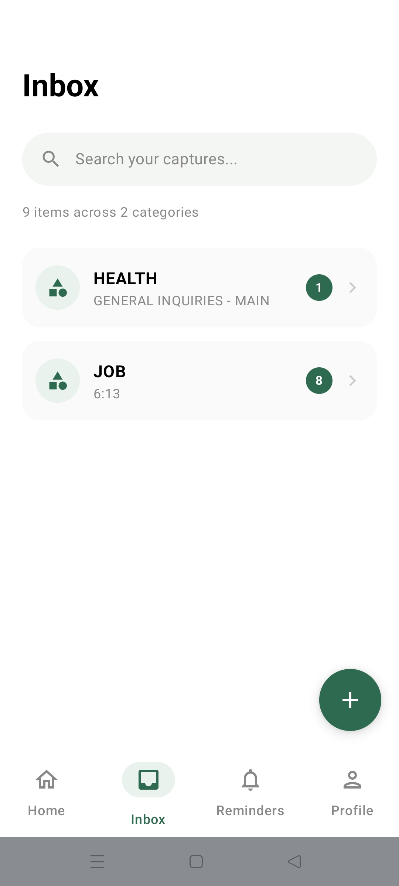
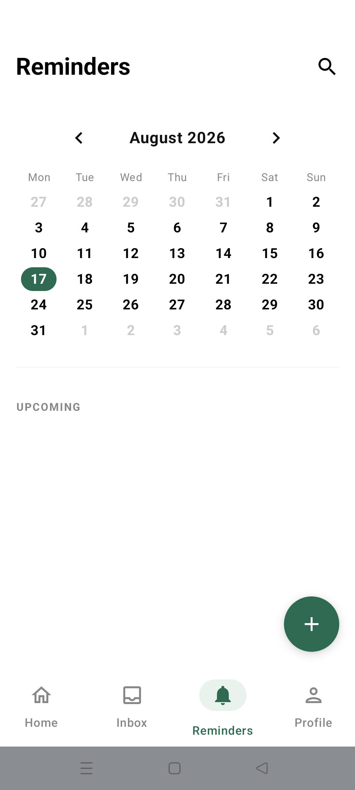
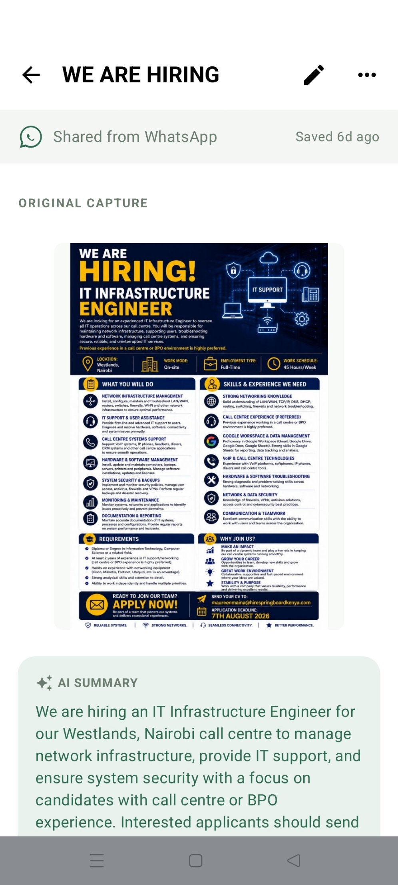

# Remindly

Remindly is a modern, AI-powered Android application designed to help you capture and remember important information from any source. Whether it's a screenshot of a job posting, a PDF document, or shared text, Remindly uses AI to extract key details and automatically schedule intelligent reminders.

## 📱 Screenshots

|             Home Page              |              Inbox              |
|:----------------------------------:|:-------------------------------:|
|  |  |

|                Reminders                |               Reminder Details               |
|:---------------------------------------:|:--------------------------------------------:|
|  |  |

## Features

- **Multi-Modal AI Capture**: Capture content via shared text, images (OCR powered by ML Kit), or PDF documents.
- **Intelligent Data Extraction**: Custom AI backend (Cloudflare Workers + Gemini) extracts titles, summaries, deadlines, and organizations automatically.
- **Smart Reminders**: Automatically schedules a sequence of notifications (7 days before, 2 days before, morning of) based on extracted deadlines using `AlarmManager`.
- **Offline-First Architecture**: View and capture content without an internet connection. Data is synced automatically when connectivity returns via `WorkManager`.
- **Responsive Design**: Optimized UI for different screen sizes (Compact, Medium, Expanded) using Jetpack Compose `WindowSizeClass`.
- **Secure Authentication**: Firebase Auth with support for Google Sign-In and Email/Password.

## Tech Stack

- **Language**: Kotlin
- **UI Framework**: Jetpack Compose
- **Architecture**: Clean Architecture + MVVM (Multi-module)
- **Dependency Injection**: Koin
- **Local Database**: Room
- **Networking**: Retrofit + OkHttp
- **Background Tasks**: WorkManager & AlarmManager
- **AI/ML**: Google ML Kit (on-device OCR) + Gemini API (backend)
- **Security**: Firebase ID-token authentication with OkHttp Interceptors

## Project Structure

```
├── :app                    # Entry point, Main Activity, Global Navigation
├── :core                   # Shared models, Repository interfaces, Theme, UI components
├── :module-features        # Feature-based UI and ViewModels (Auth, Home, Inbox, Profile, etc.)
└── :module-sources         # Data layer implementation
    ├── :local              # Room implementation, DAOs, Entities
    └── :remote             # Retrofit implementation, API services, Interceptors
```

## Getting Started

1.  **Clone the repository**.
2.  **Firebase Setup**: Add your `google-services.json` to the `app/` directory.
3.  **Local Properties**: Add your `WEB_CLIENT_ID` (for Google Sign-In) to `local.properties`:
    ```properties
    WEB_CLIENT_ID=your_web_client_id_here
    ```
4.  **Build**: Open in Android Studio and run the `:app` module.

## License

This project is licensed under the MIT License.
